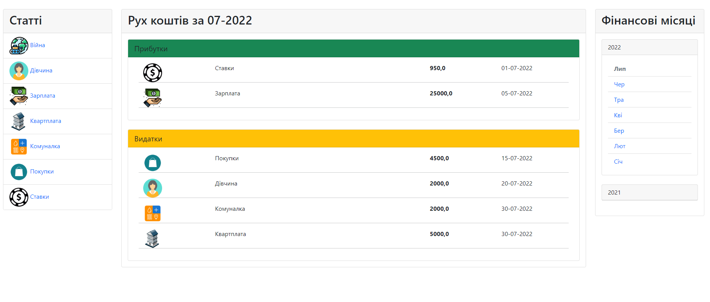
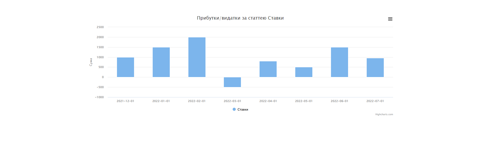

# Project name
Simple Finance

# General info
Web program for managing income and expenses in the section of articles. Provides a convenient review of monthly finances and the formation of a schedule for the use of a specific article.

# Technologies
* python 3
* django 4.0.5
* postgresql 14
* bootstrap 5.2
* highcharts
* unittest
* html
* css
* js

# Setup
To run the project install libraries specified in requirements.txt

# Status
Project is: in progress
